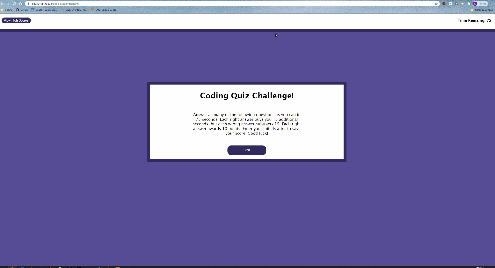
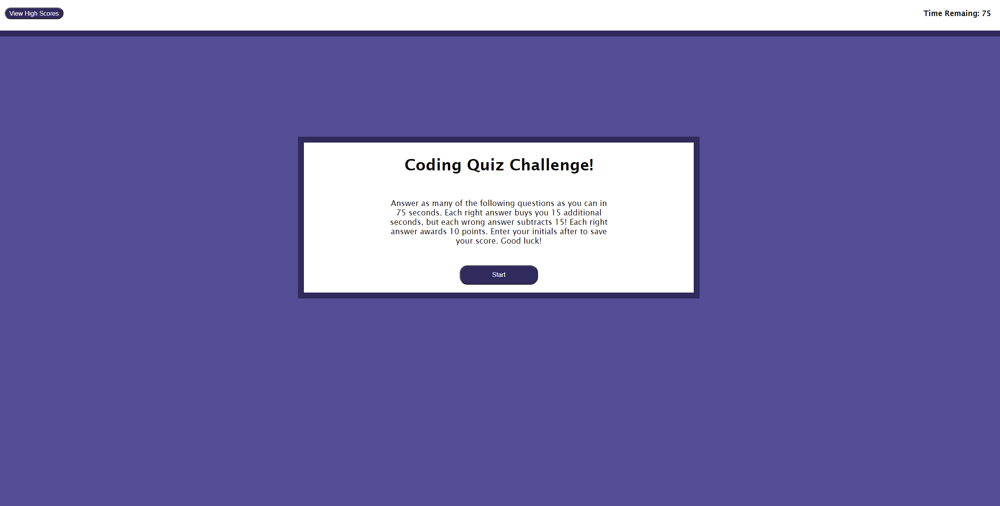
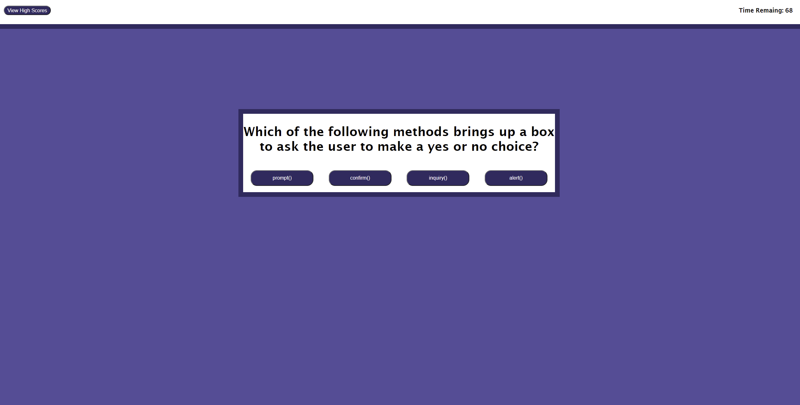
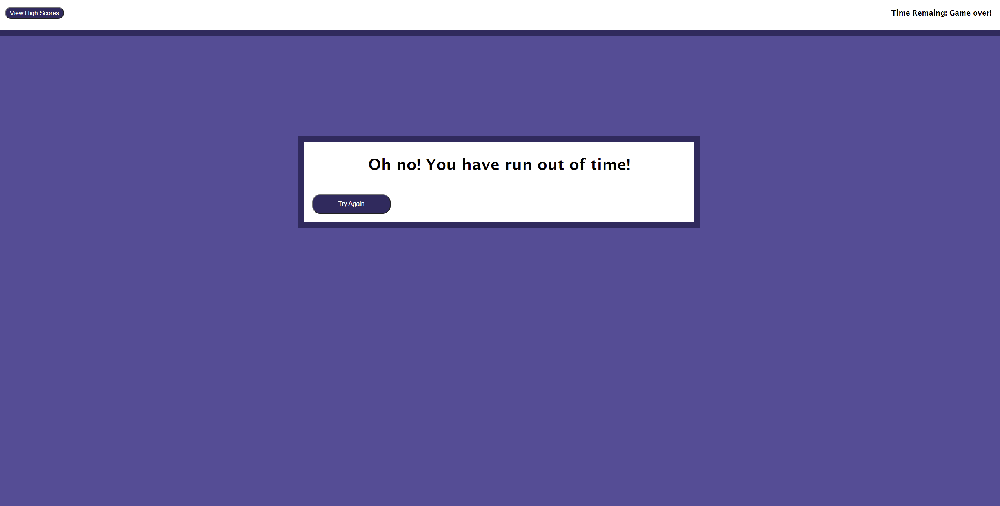
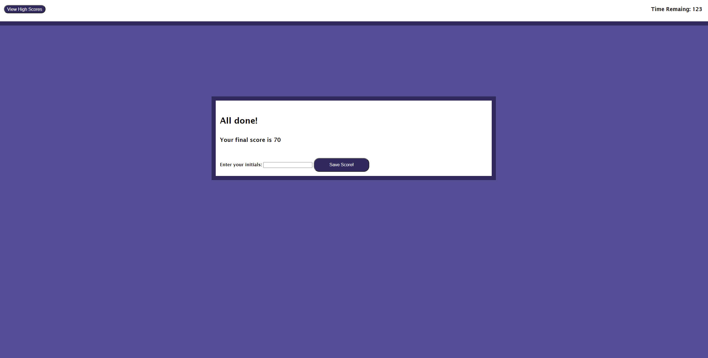
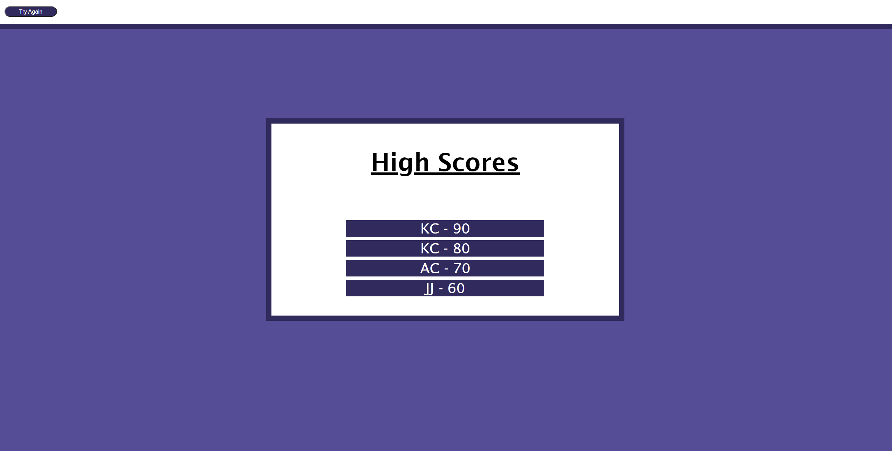
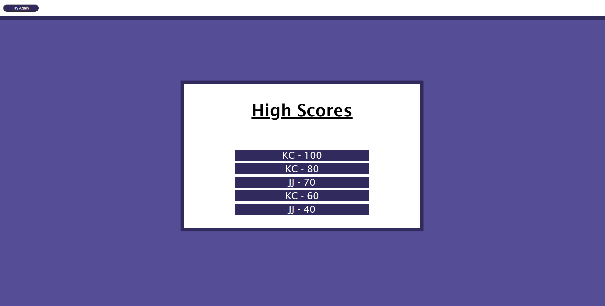

# Code Quiz

I have created a 10-question code quiz using HTML, CSS, and JavaScript. The subject matter for the quiz is all about vanilla JavaScript. I have a separate page for the high scores that is linked at the end of the quiz and can also be accessed at any time in the top left. Once the user clicks start, a timer begins to countdown from 75 seconds. Each correct answer will add 15 seconds to the clock as well as award 10 points. Each incorrect answer deducts 15 seconds from the time. If the user fails to answer all 10 questions before the timer runs out, they lose, and are given the opportunity to try again. After the user is able to answer all 10 questions within the timeframe, they will be presented with a page to fill in their initials to save their high score. Once the user clicks save, they will see a list of high scores, including their own. If this is the user's first time taking the quiz, there will be no other saved high scores.  No more than 5 high scores will be saved and they are sorted in descending order. So, higher scores will override lower scores.  After the user views the high scores, they may select Try Again in the top left to take the quiz again.

Please follow [this link](https://klay824.github.io/code-quiz/) to view the live application.

## GIF Demonstration of Application

## Screenshots

